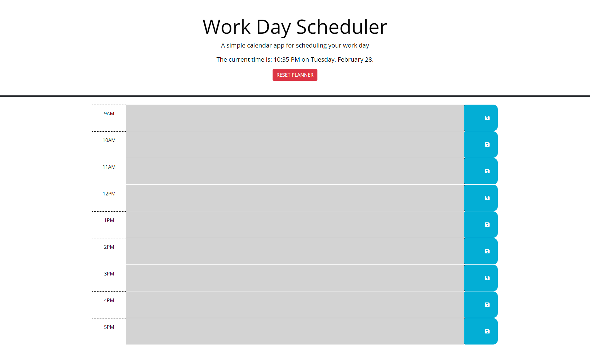

# day-scheduler

## Objective
Build a simple one-page app to save a work schedule for a typical 9am - 5pm day. Each time block will be displayed in a different color, depending whether it's a past, present, or future event. The application uses the Day.JS third-party API for fetching and displaying the date/time.

## Contents
1. [Features](#features)
2. [Technology Used](#technology-used)
3. [Web Page](#web-page)
4. [Contribution](#contribution)

## Features
* The time is dynamically updated on the page.
* When time block is clicked, user is able to add/save new events.
* When user saves a new event, the content is saved to localStorage.
* Each time block will display a certain color according to past, present, and future events.
* The saved events will persist after page refresh.
* When "RESET PLANNER" button is clicked, the entire schedule is cleared for a new day.

## Technologies Used
* HTML5
* CSS3
* JavaScript
* BootStrap 5
* jQuery
* Day.js

## Web Page

[Deployed Application](https://dereksutton.github.io/day-scheduler/)

## Contribution
* All starter code provided by Georgia Tech Coding Bootcamp.
* Planner functionality built by [Derek Sutton](https://github.com/dereksutton)
